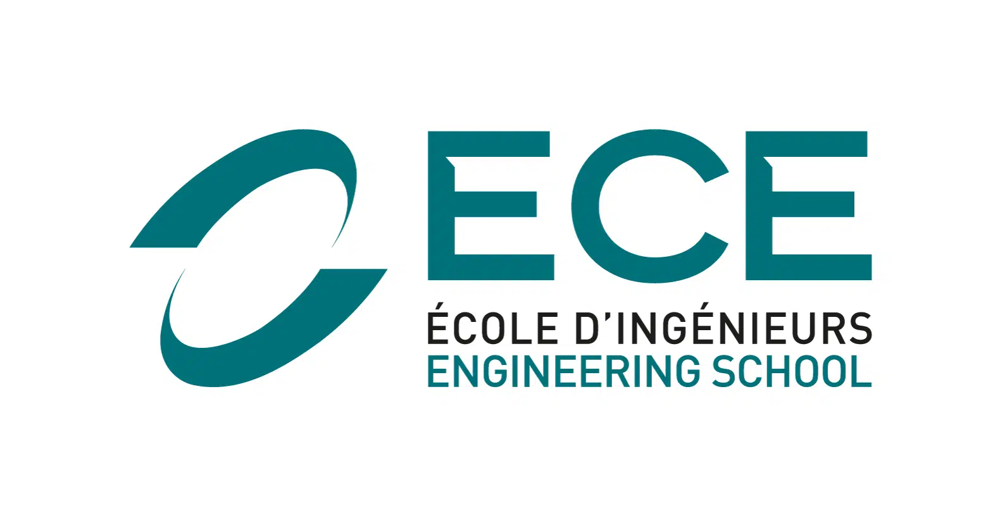

# ECE - Devops Project - ING4

## Description

During this project, we will be implementing a web API application with a Redis database along with the environment for automatating the building, testing, deployment and running of our project.

## Objectives

1. Create a web application
2. Apply CI/CD pipeline 
3. Configure and provision a virtual environment and run the application using the IaC approach
4. Build Docker image of the application
5. Make container orchestration using Docker Compose
6. Make container orchestration using Kubernetes

## 1. Create a web application

## Installation

This application is implemented in NodeJS along with a Redis database.

1. [Install NodeJS](https://nodejs.org/en/download/)
2. [Install Redis](https://redis.io/download)
3. Import the user-api application 

Go to the user-api/ directory of the cloned repository and run:

```
npm install 
```


```
npm start
```

## 2. Apply CI/CD pipeline

## 3. Configure and provision a virtual environment and run the application using the IaC approach
```
vagrant up
```
```
vagrant provision
```
## 4. Build Docker image of the application
## 5. Make container orchestration using Docker Compose
## 6. Make container orchestration using Kubernetes


## Before starting

To clone the repository
```
git clone https://github.com/AceStar0/ece-devops-ing4.git
```

To pull the repository
```
git pull
```

## Progress

- [X] Lab 1: devops-introduction
- [X] Lab 2: scm
- [X] Lab 3: continuous-testing
  - [X] Use prepared User API application and run tests
  - [ ] Using test-driven development (TDD) create GET user functionality
- [X] Lab 4: ci-cd  
  - [X] : Continuous Integration with GitHub Actions
  - [X] : Continuous Delivery (Deployment) with Heroku
- [X] Lab 5: infrustructure-as-code
  - [X] : Imperative - Using Vagrant with Shell Provisioner
    - [X] : Prepare a virtual environment
    - [X] : Create a virtual machine (VM)
    - [X] : Check that everything is OK by connecting to the VM via SSH
    - [X] : Play with different commands for Shell Provisioner
  - [X] : Declarative - GitLab installation using Vagrant and Ansible Provisioner
    - [X] : Prepare a virtual environment
    - [X] : Create and provision a virtual machine (VM)
    - [X] : Test the installation
    - [X] : Instructions for updating playbooks
  - [X] : Declarative - Configure a health check for GitLab
- [X] : Lab 6: containers with Docker
  - [X] : Install Docker
  - [X] : Write a Dockerfile and build a Docker image
  - [X] : Run a Docker with multiple options
  - [X] : Share your Docker container with a classmate
  - [X] : Build and run a multiple container app with Docker Compose


## Authors
- **Ignace BUI** - <ignace.bui@edu.ece.fr> - ING4-APP-BDA
- **Jean-Marie FANKAM** - <jeanmarie.fankam@edu.ece.fr> - ING4-APP-BDA

<footer>
  <center>
    <p>
    Copyright © Ignace BUI &  Jean-Marie FANKAM, 2022
    </p>
    
  </center>
</footer>
