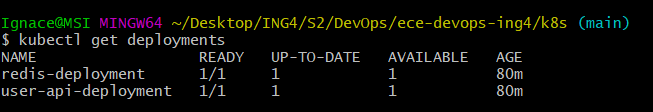

# ECE - Devops Project - ING4

## Description

During this project, we will be implementing a web API application with a Redis database along with the environment for automatating the building, testing, deployment and running of our project.

# Table of Contents

- [ECE - Devops Project - ING4](#ece---devops-project---ing4)
  - [Description](#description)
- [Table of Contents](#table-of-contents)
- [Before starting](#before-starting)
- [1. Creation of a NodeJS web application](#1-creation-of-a-nodejs-web-application)
  - [Installation](#installation)
  - [Usage](#usage)
  - [Testing](#testing)
- [2. Application of CI/CD pipeline uning Heroku and GitHub Actions](#2-application-of-cicd-pipeline-uning-heroku-and-github-actions)
- [3. Application of the IaC approach](#3-application-of-the-iac-approach)
  - [Installation](#installation-1)
- [4. Build Docker image of the application](#4-build-docker-image-of-the-application)
  - [Installation](#installation-2)
  - [Usage](#usage-1)
- [5. Organization of Container with Docker Compose](#5-organization-of-container-with-docker-compose)
- [6. Organization of Docker with Kubernetes](#6-organization-of-docker-with-kubernetes)
  - [Installation of Minikube](#installation-of-minikube)
  - [Deploy our app using Manifest YAML files](#deploy-our-app-using-manifest-yaml-files)
- [Progress](#progress)
- [Authors](#authors)

# Before starting

To clone the repository :
```
git clone https://github.com/AceStar0/ece-devops-ing4.git
```


# 1. Creation of a NodeJS web application

## Installation

This application is implemented in NodeJS along with a Redis database.

1. [Install NodeJS](https://nodejs.org/en/download/)
2. [Install Redis](https://redis.io/download)

Go to the [user-api](./user-api/) directory of the cloned repository and run:

```
npm install 
```

## Usage

  1. Run a web server

From the [user-api](./user-api/) directory of the repository, run:

```
npm run start
```


http://localhost:3000 will be accessible and our web application will run (make sure to open the Redis server):


  2. Create a user

Send a POST request using the terminal:

```bash
curl --header "Content-Type: application/json" \
  --request POST \
  --data '{"username":"sergkudinov", "firstname":"sergei", lastname":"kudinov"}' \
  http://localhost:3000/user
```

It will output:

```
{"status":"success","msg":"OK"}
```  
After, if you go to http://localhost:3000/user/sergkudinov, with "sergkudinov" being the username that you had in your POST data, it will display in the browser the following, with correspondance to the data that you posted:  

```
{"status":"success","msg":{"firstname":"sergei","lastname":"kudinov"}}
```

## Testing

From the root directory of the project, run:

```
npm run test
```  
  
All 12 tests should be passed :  


# 2. Application of CI/CD pipeline uning Heroku and GitHub Actions

  * Continuous Integration with GitHub Actions
  * Continuous Delivery (Deployment) with Heroku
  
We created an YAML file [.github/workflow/main.yml](./.github/workflows/main.yml) and we add this code :

```yml
# This workflow will do a clean install of node dependencies, cache/restore them, build the source code and run tests across different versions of node
# For more information see: https://help.github.com/actions/language-and-framework-guides/using-nodejs-with-github-actions

name: Main CI/CD

on:
  push:
    branches: [ main ]
  pull_request:
    branches: [ main ]

jobs:
  # CI part
  test:
    runs-on: ubuntu-latest
    # Define working-directory if you application is in a subfolder
    defaults:
      run:
        working-directory: user-api
     # Service containers to run with runner-job

    strategy:
      matrix:
        node-version: [16.x]
        # See supported Node.js release schedule at https://nodejs.org/en/about/releases/
        redis-version: [4, 5, 6]
        
    steps:
    - uses: actions/checkout@v2
    - name: Use Node.js ${{ matrix.node-version }}
      uses: actions/setup-node@v2
      with:
        node-version: ${{ matrix.node-version }}
        
        
    - name: Start Redis
      uses: supercharge/redis-github-action@1.4.0
      with:
        redis-version: ${{ matrix.redis-version }}

    - run: npm install
    - run: npm test
  # CD part
  deploy:
    needs: test # Requires CI part to be succesfully completed
    runs-on: ubuntu-latest
    steps:
      - uses: actions/checkout@v2
      # Read instructions how to configure this action: https://github.com/marketplace/actions/deploy-to-heroku#getting-started
      - uses: akhileshns/heroku-deploy@v3.12.12 # This is the action
        with:
          heroku_api_key: ${{secrets.HEROKU_API_KEY}}
          heroku_app_name: "ece-devops-ing4" #Must be unique in Heroku
          heroku_email: "ignace.bui@outlook.com"
          appdir: user-api # Define appdir if you application is in a subfolder
```
Once the CI/CD is integrated, we do have an automatic deployment in the Github Actions tab :


As we have configured Heroku, we can check our Heroku app and we do have our web application running :


Redis service on Heroku is free, but it requires adding credit card information. Considering this limitation we will not run Redis on Heroku, and the application will be partially non-functional (it will print the "Hello world!" message on the home page, but the user API will not work). However, it will be enough to experience our CI/CD pipeline.


# 3. Application of the IaC approach

## Installation 

Make sure you install these tools :

1. [Install VirtualBox](https://www.virtualbox.org/wiki/Downloads) 
2. [Install Vagrant](https://www.vagrantup.com/downloads.html)  
  
```
vagrant up
```
```
vagrant provision
```


# 4. Build Docker image of the application

## Installation

* [Docker Desktop](https://www.docker.com/get-started)  
  
## Usage

* We have created an build an image of our app and pushed it to Docker Hub :


* In the [user-api](./user-api/) directory of the repository's clone (where you can also find the [Dockerfile](/user-api/Dockerfile)), run the following command to pull our image :
 
```bash
docker pull acestar01/user-api
```    

* Check if you have pulled the images to your local Docker images with the following command:
```bash
docker images
```    

* Run the image:
```bash
docker run -p 12345:3000 -d acestar01/user-api
```   
  
* Check if the container is running or not, with the collowing command :
```bash
docker ps
```  

* Now open your localhost: http://localhost:12345/, and if all went fine, you will have:  

(imaggeeeeeeee)


# 5. Organization of Container with Docker Compose

* Configure the [`docker-compose.yaml`](docker-compose.yaml) file to pull our user-api image : 
```yml
version: '3'

services:
  redis:
    image: redis

  web:
    build: .
    ports:
      - "5000:3000"
    image: acestar01/user-api
```

# 6. Organization of Docker with Kubernetes

##  Installation of Minikube

* [Install Minikube](https://kubernetes.io/docs/tasks/tools/install-minikube/) following the instructions depending on your OS.

Start Minikube with:

```
minikube start
```

Verify that everything is OK with:
```
minikube status
```


## Deploy our app using Manifest YAML files

* Configure out the [`./k8s/deployment.yml`](./k8s/deployment.yml) file :

```yml
apiVersion: apps/v1
kind: Deployment
metadata:
  name: redis-deployment
  labels:
    app: redis
spec:
  replicas: 1
  selector:
    matchLabels:
      app: redis
  template:
    metadata:
      labels:
        app: redis
    spec:
      containers:
      - name: redis
        image: redis
        ports:
          - containerPort: 6379
---

apiVersion: apps/v1
kind: Deployment
metadata:
  name: user-api-deployment
  labels:
    app: user-api
spec:
  replicas: 1
  selector:
    matchLabels:
      app: user-api
  template:
    metadata:
      labels:
        app: user-api
    spec:
      containers:
      - name: user-api
        image: acestar01/user-api
        ports:
          - containerPort: 3000
        env:
          - name: REDIS_HOST
            value: redis-master
          - name: REDIS_PORT
            value: "6379"
```

* Once completed, run:
   ```
   kubectl apply -f deployment.yaml
   ```

* Configure out the [`./k8s/service.yml`](./k8s/service.yml) file :

```yml
apiVersion: v1
kind: Service
metadata:
  name: redis-service
  labels:
    app: redis
spec:
  ports:
    - name: http
      port: 6379
      targetPort: 6379
  selector:
    app: redis

---

apiVersion: v1
kind: Service
metadata:
  name: user-api-service
spec:
  type: NodePort
  selector:
    app: user-api
  ports:
    - name: http
      port: 3000
      targetPort: 3000
```

* Once you completed the file, run:
   ```
   kubectl apply -f service.yaml
   ```

* Check if the deployments are running with the following command :
  
```bash
kubectl get deployments
```  



* Check if the services are running with the following command :
```bash
kubectl get services
```


* Check if the pods are running with the following command :
```bash
kubectl get pods
```  
It should print you that: 
(imageeeee)
  

* We can use the [dashboard](https://minikube.sigs.k8s.io/docs/handbook/dashboard/) functionnality of Minikube to have a summary of the status through a dashboard with the following command that will open a new webpage :  
```bash
minikube dashboard
```  


# Progress

- [X] Lab 1: devops-introduction
- [X] Lab 2: scm
- [X] Lab 3: continuous-testing
  - [X] Use prepared User API application and run tests
  - [ ] Using test-driven development (TDD) create GET user functionality
- [X] Lab 4: ci-cd  
  - [X] : Continuous Integration with GitHub Actions
  - [X] : Continuous Delivery (Deployment) with Heroku
- [X] Lab 5: infrustructure-as-code
  - [X] : Imperative - Using Vagrant with Shell Provisioner
    - [X] : Prepare a virtual environment
    - [X] : Create a virtual machine (VM)
    - [X] : Check that everything is OK by connecting to the VM via SSH
    - [X] : Play with different commands for Shell Provisioner
  - [X] : Declarative - GitLab installation using Vagrant and Ansible Provisioner
    - [X] : Prepare a virtual environment
    - [X] : Create and provision a virtual machine (VM)
    - [X] : Test the installation
    - [X] : Instructions for updating playbooks
  - [X] : Declarative - Configure a health check for GitLab
- [X] : Lab 6: containers with Docker
  - [X] : Install Docker
  - [X] : Write a Dockerfile and build a Docker image
  - [X] : Run a Docker with multiple options
  - [X] : Share your Docker container with a classmate
  - [X] : Build and run a multiple container app with Docker Compose


# Authors
- **Ignace BUI** - <ignace.bui@edu.ece.fr> - ING4-APP-BDA
- **Jean-Marie FANKAM** - <jeanmarie.fankam@edu.ece.fr> - ING4-APP-BDA

<footer>
  <center>
    <p>
    Copyright © Ignace BUI &  Jean-Marie FANKAM, 2022
    </p>
    
  </center>
</footer>
